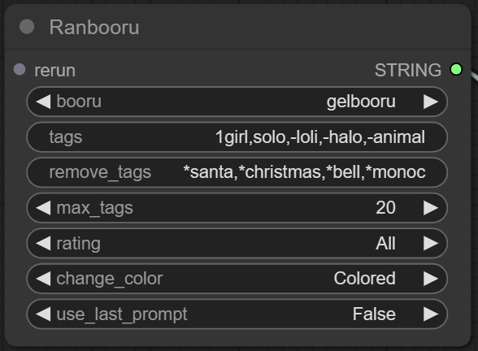
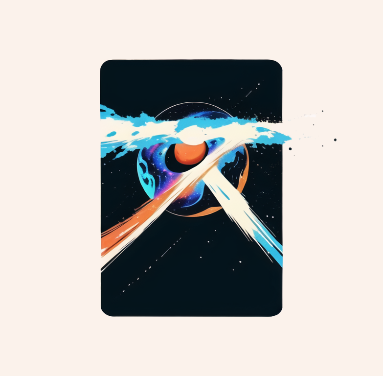

# Ranbooru for ComfyUI

Ranbooru is an extension for the [comfyUI](https://github.com/comfyanonymous/ComfyUI). The purpose of this extension is to add a node that gets a random set of tags from boorus pictures. This is mostly being used to help me test my checkpoints on a large variety of tags.

## Installation
Just clone this repository into the custom_nodes folder of ComfyUI. Restart ComfyUI and the extension should be loaded.

## Features
These are the nodes available in the Ranbooru extension:
### Ranbooru  
This node will get a random set of tags from boorus pictures.
Parameters:
- **Booru**: The booru to get the tags from.
- **Tags**: The tags to search for.
- **remove_tags**: The tags to remove from the search.
- **max_tags**: The maximum amount of tags to get.
- **rating**: The mature rating of the picture.
- **change_color**: Change this if you want a colored or a black and white picture.
- **use_last_prompt**: If you want to use the last prompt as the tags.
- **return_picture**: If you want to return the picture as well.

### Random Picture Path
This node will get a random picture from a specific path.
- **path**: The path to get the picture from.
- **include_subfolders**: If you want to include subfolders in the search.

## Found an issue?  
If you found an issue with the extension, please report it in the issues section of this repository.  

## Check out my other scripts for 1111automatic
- [Ranbooru](https://github.com/Inzaniak/sd-webui-ranbooru)
- [Workflow](https://github.com/Inzaniak/sd-webui-workflow)

---
## Made by Inzaniak
 

If you'd like to support my work feel free to check out my Patreon: https://www.patreon.com/Inzaniak

Also check my other links:
- **Personal Website**: https://inzaniak.github.io 
- **Deviant Art**: https://www.deviantart.com/inzaniak
- **CivitAI**: https://civitai.com/user/Inzaniak/models
